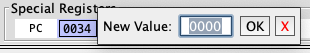
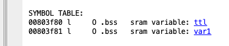
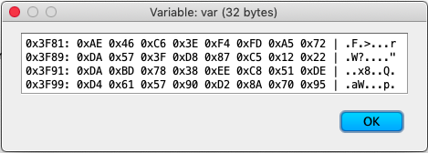

### Using the Debugger

Using the debugger is relatively straigtforward, but there are several steps you need to follow:

  1. The target device must be connected, have operational power supplied to its Vcc pin.
  2. The [programmer/debugger](programmers.md) device must connect to Vcc, Gnd and the UPDI pin (see datasheet for target device.)
  3. The device to debug should be selected as the compile target (using either the `target #pragma`, or the Target menu) source code loaded.
  4. Use the Build menu to compile the code and bring up the Listing Pane showing the compiled assembly code.
  5. Select Settings->Show Debugger (or press CMD D) to display the debugger at the the top of the Listing Pane.
  6. Press the "ATTACH" to tell the programmer/debugger to take control of the target device.
  7. The first line of code in the jump table should be highlighted to indicate the debugger is ready to RUN or STEP though the code.
  9. Press STEP and watch the debugger execute the jump instruction and the hightlighted line should now show the instruction thet will be executed if you press STEP again.
  10. As you STEP through the code, you can watch the value of the registers, flags and I/O ports change in response to each instruction.  At each step, the debugger will highlight which registers, flags and I/O bits that have changed.

### Setting a Hardware Breakpoint

In addition to stepping through the code, you can also set a single hardware breakpoint by clicking one of the bubbles (O) in the left hand gutter.  The bubble should show as solid when the breakpoint is active.  Note: you can only set one hardware breakpoint at a time (the interface will unselect a previously set bubble when you select a new one.)  Once a hardware breakpoint is set, press RUN to start the target code and the debugger will stop the target automatically when the breakpoint is reached.  Or, you can press STOP to stop the target code at any time.  When stopped, the debugger will update the registers, flags and I/O ports to show the current state.  You can then resume by pressing RUN or STEP.

### Changing the Values of Registers and Flags

When the debugger is ATTACHed and STOPped, you can change the value of the registers and flags by placing the mouse over the feild and right clicking to bring up a dialog like this:

Then, type in a new value and press [OK] to change it, or press [X] to cancel.  The debugger will then update this value in the target as well as the debugger display, such that when you press RUN or STEP the new value will be active.

## Can I Edit the I/O Ports?

Currently, MegaTinyIDE does not support editing of the I/O port values, as there are side effects, such as triggering port change interrupts that MegaTinyIDE cannot handle properly.  In addition, to simplify the debugger display, only the value of the IN Port is displayed, this make it possble to see the state of both input and output pins at the same time.  However, if you hover over an active I/O pin (inactive/unavailable I/O bits are greyed out) a pop up tool tip will show whether this pin is set as an INPUT or an OUTPUT.

Note: a future revision of MegaTinyIDE may add the ability to directly view and/or edit additional I/P ports, but this is yet to be designed and implemented.  If you have any suggections, [please post in Discussions](https://github.com/wholder/MegaTinyIDE/discussions).

### Examine SRAM Values

If your code has declared values in SRAM, these values will be shown with an active hyperlink in the Listing Pane, as show here:

When the debugger is ATTACHed and STOPped, clicking the link will bring up a dialog that shows the current contents of the SRAM space:

Note: you cannot currently edit these values, but this is a feature I hope to add in the new future.
