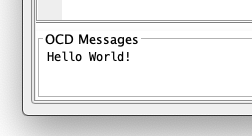

### OCD Messaging

The UPDI (or 1-wire PDI) interface supports a way to send messages from a target device back to the debugger using a special polling technique.  When MegaTinyIDE's debugger is placed into RUN mode, it begins to poll the target for Break and Message events.  Break events indicate that a breakpoint has been reached and Message events indicate that the target has a byte of data waiting for the debugger to read.  In the current implementation, MegaTinyIDE's debugger assumes that each byte is a sequence of one, or more ASCII characters that form a message that the target want to send to the debugger.  Once a complete line of text (terminated by a LF, or 'linefeed' character) is received by the debugger, it opens a slide up window at the bottom of the Listing Pane and begins to display these messages in a scrolling text pane.

   
The following program illustrates how to use OCD Messaging to send a repeating series of `"Hello World!"` messages back to the debugger using this feature.

    #include <avr/io.h>
    #include <util/delay.h>
    
    #pragma chip attiny212
    #pragma clock 20 MHz
    
    #define SYSCFG_OCDM  _SFR_IO8(0x0F18)  // Message port
    #define SYSCFG_OCDMS _SFR_IO8(0x0F19)  // Status Port (bit 0 is HIGH while busy)
    
    void ocd_print (char* pmsg) {
      uint8_t timeout = 100;
      // Send the message one byte at a time
      while (*pmsg) {
        while (timeout-- && (SYSCFG_OCDMS & 0x01) != 0) {
          // wait for debugger to read last char sent, or a timeout
            _delay_ms(1);
        }
        // If the debugger fails to collect and timeout expires, return
        if (timeout == 0) {
          return;
        }
        // Send next byte of message, then delay 50 ms
        SYSCFG_OCDM = *pmsg++;
        _delay_ms(50);
      }
    }
    
    int main (void) {
      CPU_CCP = 0xD8;                 // Enable Configuration Change Protected register
      CLKCTRL.MCLKCTRLB = 0x00;       // Set Clock to 20 MHz
      while (1) {
        ocd_print("Hello World!\n");
        _delay_ms(2000);              // Delay 2 seconds
      }
    }

Data value are written to the `SYSCFG_OCDM` register which, in turn, sets a bit in the `SYSCFG_OCDMS` register which causes the debugger to receive an event that indicates a byte of message data is waiting.  The bit is in the `SYSCFG_OCDMS` register is cleared when the debugger reads the byte which in turn, signals the target code that it is free to send the next byte of data.  These bytes are accumulated in a buffer until a LF character is received, at which time the message is printed to the OCD Message window and the buffer is cleared. 
