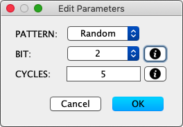

### Pragmas

The `#pragma` directive is the method specified by the C standard for providing additional information to the compiler.  MegaTinyIDE defines a set of pragmas that you can use to set special features, such as telling the compiler what clock rate the clock rate the target is using so that calls to functions like `delay()` can calculate the proper timing.  The following pragma are currently available:

  + `#pragma clock`
  + `#pragma target `(or `chip`)
  + `#pragma define`
  + `#pragma parm`
  
### `#pragma clock (Mhz, kHz, Hz)`

The `clock` pragma is used to define the value that should be passed to the compiler using the `-DF_CPU=nn` switch.  The clock rate can be defined in units of Mhz, kHz, or Hz, such as:

     #pragma clock 20,000,000 Hz
     #pragma clock 20 Mhz
     #pragma clock 20,000 kHz
     pragma clock 20000000
   
All of the able examples are equivalent set the clock rate parameter to 20 Mhz.  Note: this values does not set the clock rate that the target chip uses, it simply tells the compiler what clock rate the chip is set to use.  The physical clock rate in the target attiny needs to be set by fuses and/or programmed instructions.

### `#pragma target (or chip)`

The `target` or `chip` pragma uses the `-mmcu` switch to tell the compiler which is the attiny series microcontroller the code being compiled is designed to run on.  The compiler uses this to see of if physical limits, such as available Flash or RAM space are exceeded.  The following example tells the compiler that the code is intended to run on an attiny212

     #pragma chip attiny212

Note: the target attiny chip can also be set in MegaTinyIDE using the `Target` menu, but this pragma is a way to set the target in the code do that is setup automaticlaly each time the source file is loaded.

### `#pragma define`

The `define` pragma is provided as a way to pass additional `-D` switches to the compiler.  For example, you can also set the clock rate using a `define` pragma, like this:

    #pragma define F_CPU=20000000
    
However, unlike the `clock` pragma, only a numeric value (without commas and in Hz) can be used as the value.

### `#pragma parm`

The `parm` `pragma` is used to dynamically create a pop up GUI that appears with the "Build" option is invoked and which you can use to prompt for various compile time options.  For example, the follow `parm` pragma will prompt you to select from one of 5 values (1-5) with the default value of 2 being preselected:

    #pragma parm (BIT:1:2:3:4:5, 2)

The selected value will then be passed to the compiler as a -D switch for a parameter named "BIT", such as `-DBIT=3`.  The `parm` paragma is intended as a way to create and published parameterized programs for non progerammers.  For example, the following `parm` pragma could be used to configure a program designed to flash LEDs in various patterns by prompting the user to .

    #pragma parm (PATTERN:Random=0:Chaser=1:Disco=2:Cylon=3:Stripes=4, 1)

Like the first example, this one prompts the user to select from one of 5 options ("Random", "Chaser", "Disco", "Cylon", "Stripes") with "Chaser" being the preselected value.  However, instead of passing in the selected text, such as "Chaser" as the value, the numeric value after the "`=`" is passed in as the value.  For example, if you select "Stripes", the `-D` switch generated will be `-DPATTERN=4` and the value of PATTERN will be set to 4.

In addition to selecting values from a list, you can also prompt for an unconstrained value, like this:

    #pragma parm (CYCLES, 5) 
    
This `parm` pragma generates a pop up prompt that has a text field prepopulated with the value 5, but which you can change and type in any value.

If explanatory text is needed for a parameter, you can add it within "`{}`" at the end of the `parm` pragma, such as:

    #pragma parm (CYCLES, 5) {Select the number of flashing cycles}

