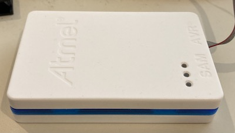
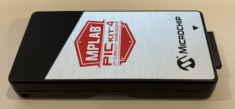
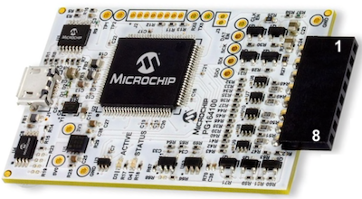
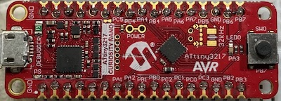
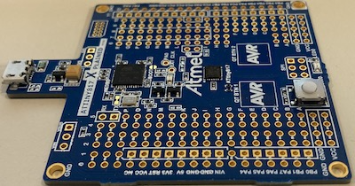
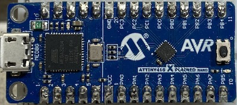
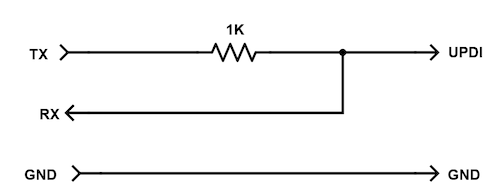
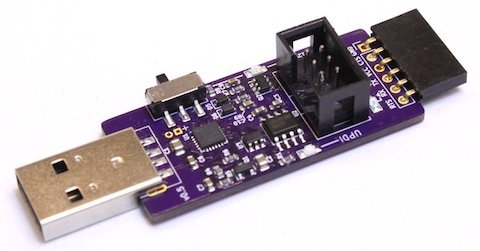

While Microchip currently chooses to make the debugging portion of the UPDI protocol a proprietary secret, [it has documented](http://ww1.microchip.com/downloads/en/DeviceDoc/50002630A.pdf) how to use one of its UPDI-compatible programmers, such as the Atmel-ICE or PICKit-4 as a debugger.  In addition, several of its development boards, such as the [ATTiny3217-Curiosity-Nano](https://www.microchip.com/DevelopmentTools/ProductDetails/PartNO/EV50J96A), contain onboard chips that can be used to both program and debug the target attiny chip using the UPDI protocol.  With some limitations, MegaTinyIDE is able to debug using one these UPDI-compatible programmers or development boards.

## How UPDI Works

The nice thing about about the UPDI interface is that, in addition to Vcc and Gnd, you only need to make a single connections to a target device to both program and debug it.  For the Atmel-ICE and PICKit-4, the Vcc connection is only used to determine the voltage your target attiny chip is using.  For all the current 1-series and 0-series attiny chips, this debugging connection is made to the RESET pin, which also the PA0 pin.  For these new attiny chips, Vcc is always pin 1 a Gnd is always the last numerical pin.  While I recommend you check the datasheet to be sure, the location of the UPDI/RESET/PA0 pin can be located, as follows:

  - SOIC-8  - pin 6
  - SOIC-14 - pin 10
  - SOIC-20 - pin 16
  - VQFN-20 - pin 19
  - VQFN-24 - pin 23

## Atmel-ICE

The [Atmel-ICE](https://www.microchip.com/DevelopmentTools/ProductDetails/ATATMEL-ICE) is currently the most expensive ([~$150 at Mouser](https://www.mouser.com/ProductDetail/Microchip-Technology-Atmel/ATATMEL-ICE-BASIC?qs=KLFHFgXTQiAG498QgmqIdw%3D%3D), [~$150 at Digi-Key](https://www.digikey.com/en/products/detail/microchip-technology/ATATMEL-ICE-BASIC/4753381)) and least flexible of Microchip's UPDI-compatible programmers.  In addition older versions of the Atmel-ICE may need to be updated and modified using Microchip's MPLAB software before MegaTinyIDE will be able to detect them, as the USB interface has changed over time.  Debugging with the Snap requires making three connections to the target ATtiny using the 6-pin adapter usually provided with the Atmel ICE kit, as follows:

  - Connect pin 1 of the adapter cable to UPDI on the target
  - Connect pin 2 of the adapter cable to Vcc on the target
  - Connect pin 6 of the adapter cable to Gnd on the target

Note: the Vcc connection is used by the Atmel-ICE to detect that the targt has power, not to supply power.

## PICKit-4

The [PICKit-4](https://www.microchip.com/developmenttools/ProductDetails/PG164140) is less expensive ([~$90 at Mouser](https://www.mouser.com/ProductDetail/Microchip-Technology/PG164140?qs=sGAEpiMZZMu3sxpa5v1qrvyz3TtLhlhta1L5sRADGIM%3D), [~$90 at Digi-Key](https://www.digikey.com/en/products/detail/microchip-technology/PG164140/8536593)) and more flexible than the Atmel-ICE, as it can also be used with PIC-based MCUs and is also capable of High Voltage program, which can be used to unlocked locked chips (not currently supported by MegaTinyIDE.)  Debugging with the PICKit-4 requires making three connections to the target ATtiny, as follows:

  - Connect PICKit-4 pin 2 to Vcc on the target (note: pin 1 is indicated by the triangle)
  - Connect PICKit-4 pin 3 to Gnd on the target
  - Connect PICKit-4 pin 4 to UPDI on the target

## MPLAB Snap

The [MPLAB Snap In-Circuit Debugger/Programmer](https://www.microchip.com/developmenttools/ProductDetails/PartNO/PG164100) is a less expensive ([~$40 at Mouser](https://www.mouser.com/ProductDetail/Microchip-Technology/PG164100?qs=w%2Fv1CP2dgqoaLDDBjfzhMQ%3D%3D), [~$40 at Digi-Key](https://www.digikey.com/en/products/detail/microchip-technology/PG164100/9562532)), stripped down version of the PICKit-4 that comes in the form of a naked PC board, but the files needed to 3D print a case can be [downloaded from Thingiverse](https://www.thingiverse.com/thing:3074301).  However, unlike the PICKit-4, the Snap cannot perform High Voltage programming.  Debugging with the Snap requires making three connections to the target ATtiny, as follows:

  - Connect Snap pin 2 to Vcc on the target
  - Connect Snap pin 3 to Gnd on the target
  - Connect Snap pin 4 to UPDI on the target

## ATTiny3217-Curiosity-Nano

The [ATTiny3217-Curiosity-Nano](https://www.microchip.com/DevelopmentTools/ProductDetails/PartNO/EV50J96A) is a small, inexpensive ([~$25 at Mouser](https://www.mouser.com/ProductDetail/Microchip-Technology/EV50J96A?qs=OlC7AqGiEDlhXXlje7rJaw%3D%3D), [~$25 at Digi-Key](https://www.digikey.com/en/products/detail/microchip-technology/EV50J96A/11618271)) development board that contains both an ATTiny3217 and a SAMD21E18A pre-programmed to act as a programmer and debugger for the ATTiny3217.  The SAMD21E18A acting as the debugger is reasonably fast and runs a more full-featured version of Microchip's debugger software called nEDBG.

Note: Section 3.5 "Programming External Microcontrollers" of the [ATTiny3217-Curiosity-Nano Hardware User Guide](http://ww1.microchip.com/downloads/en/DeviceDoc/40002193A.pdf) describes how the board can be modified to program external target devices.  At $19, this makes the ATTiny3217-Curiosity-Nano board the cheapest programmer/debugger with reasonably fast operation that you can currently buy.

## ATTiny817-Xplained-Mini

The [ATTiny817-XPlained-Mini](https://www.microchip.com/developmenttools/ProductDetails/attiny817-xmini) is a small, inexpensive ([~$15 at Mouser](https://www.mouser.com/ProductDetail/Microchip-Technology-Atmel/ATTINY817-XMINI?qs=4HkvMi8iULuSEeBz6fjmlQ%3D%3D), [~$15 at Digi-Key](https://www.digikey.com/en/products/detail/microchip-technology/ATTINY817-XMINI/6226926)) development board that contains both an ATTiny817 and a ATmega32U4 pre-programmed to act as a programmer and debugger for the ATTiny817.  The ATmega32U4 acting as the debugger is relatively slow and runs a cut-down version version of Microchip's debugger software called mEDBG.  In theory, the on-board ATmega32U4 could be used to program and debug external target devices, as the UPDI protocol is the same for all members of the new attiny family, but Microchip does not supply instructions on how to do this.

## ATTiny416-Xplained-Nano

The [ATTiny416-XPlained-Nano](https://www.microchip.com/developmenttools/ProductDetails/attiny817-xmini) is a small, inexpensive ([~$15 at Mouser](https://www.mouser.com/ProductDetail/Microchip-Technology-Atmel/ATTINY416-XNANO?qs=1mbolxNpo8fQGr9Vr3B9Wg%3D%3D), [~$15 at Digi-Key](https://www.digikey.com/en/products/detail/microchip-technology/ATTINY416-XNANO/7801795?s=N4IgTCBcDaIIIBUEEsB2BPALARgGwgF0BfIA)) development board that contains both an ATTiny416 and a ATmega32U4 pre-programmed to act as a programmer and debugger for the ATTiny416.  The ATmega32U4 acting as the debugger is relatively slow and runs a cut-down version version of Microchip's debugger software called mEDBG.  In theory, the on-board ATmega32U4 could be used to program and debug external target devices, as the UPDI protocol is the same for all members of the new attiny family, but Microchip does not supply instructions on how to do this.

## USB/Serial-based Programmers

Note: the following schemes only supports the following basic programming functions and do not support debugging:

+ Read Flash
+ Disassemble Flash
+ Program Flash
+ Read/Modify Fuses
+ Read/Modify EEPROM
+ Read/Modify USERROW
+ Identify Device

First, using nothing more than some basic wiring and a single 1K resistor, it's possible to use a USB/Serial adapter as a UPDI programmer.  The circuit looks like this:

However, I've found that this circuit only works with certain USB/Serial adaptera, such as Adafruit's [FTDI Friend](https://www.adafruit.com/product/284) or Sparkfun's [FTDI Basic Breakout](https://www.sparkfun.com/products/9716) boards.  Other adapters often contain additional components, such as LEDs that are directly connected to the RX and TX lines which add extra loads.  For adapter boards with LEDs on these lines (which are often based on the CH340 series chips), it sometimes works to remove these LEDs (and any accompany resistors.)  But, I think is easier to stick with adapters that don't do this.

### 12 Volt Programming

You might also consider using a [USB/Serial-based programmer](https://www.tindie.com/products/leonerd/avr-updi-programmer-with-12v/) available on Tindie.  This design has a switch to select sending a 12 volt, "high voltage" pulse which can enable programming even when the UPDI pin has been set to function as a RESET or GPIO pin.

Note: this programmers uses a Silicon Labs CP2105 for its USB to serial interface.  This IC actually contains 2 serial interfaces, so you need to select the one that's used as the programmer side.  On macos, this should appear as something like "/dev/cu.SLAB_USBtoUART" in the programmer selection menu.  The other serial port is intended for use as a regular serial port and should appear as something ilke "/dev/cu.SLAB_USBtoUART23".